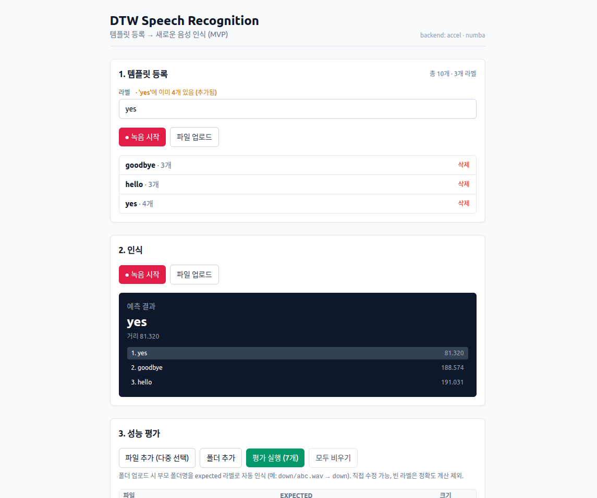

# DTW 기반 음성 인식 시스템

DTW(Dynamic Time Warping) 알고리즘 기반의 경량 음성 인식 시스템입니다.
**FastAPI 백엔드 + React 웹 UI + 순수 Python 도메인 코어**의 3계층 구조로,
브라우저에서 마이크로 녹음·등록·인식·배치 평가를 모두 수행할 수 있습니다.



---

## ✨ 주요 특징

- **풀스택 즉시 사용** — REST API + React UI 제공, 브라우저만 있으면 바로 데모 가능
- **순수 NumPy 코어** — 기본 의존성 최소, 설치 즉시 동작
- **선택적 가속 백엔드** — Numba JIT으로 약 50~250× 가속 (`requirements-accel.txt`)
- **교체 가능한 인터페이스** — `core` / `accel` 동일 API, 결과 수치 동등성 검증
- **배치 평가 내장** — 다중 파일/폴더 업로드 → 정확도·라벨별 P/R/F1 자동 계산
- **영속화** — SQLite + `.npy` 블롭, tar.gz 스냅샷 백업 지원
- **프레임워크 독립 도메인** — `src/`는 FastAPI에 비종속이라 노트북·CLI에서도 재사용

---

## 🚀 빠른 시작

### 1) 백엔드 (FastAPI)

```bash
# (예시) miniconda 환경
conda activate py310_pt

cd backend
pip install -r requirements.txt -r requirements-accel.txt -r requirements-api.txt
./run_api.sh                    # uvicorn → http://localhost:8000
# Swagger 문서: http://localhost:8000/docs
```

가속 백엔드를 사용하지 않을 경우 `requirements-accel.txt`는 건너뛰어도 됩니다.

### 2) 프론트엔드 (React + Vite, Node 18+)

```bash
cd frontend
npm install
npm run dev                     # http://localhost:5173
```

Vite 개발 서버가 `/api/*`를 `http://localhost:8000`으로 프록시합니다.

### 3) Python 스크립트만 사용

```bash
cd backend
python examples/complete_example.py
```

---

## 📦 프로젝트 구조

```
dtw_project/
├── backend/                          # FastAPI + DTW 인식 엔진
│   ├── app/                          # API 계층 (라우터·서비스·스키마·설정)
│   │   ├── main.py                   # FastAPI 앱 + 부팅 웜업
│   │   ├── api/                      # /templates · /recognize · /evaluate · /admin · /health
│   │   ├── core/config.py            # Pydantic 환경 설정
│   │   ├── schemas/responses.py      # 응답 모델
│   │   └── services/                 # RecognizerService · TemplateStore
│   ├── src/                          # 도메인 코어 (프레임워크 독립)
│   │   ├── feature_extraction.py     # MFCCExtractor
│   │   ├── dtw_algorithm.py          # DTWAlgorithm 파사드
│   │   ├── speech_recognizer.py      # SpeechRecognizer
│   │   ├── evaluation.py             # 평가 메트릭
│   │   └── backends/                 # core (NumPy) | accel (Numba)
│   ├── data/                         # 런타임 데이터 (gitignored)
│   │   ├── store.db                  # SQLite 메타데이터
│   │   ├── templates/*.npy           # 특징 블롭
│   │   └── backups/                  # tar.gz 스냅샷
│   ├── examples/                     # 데모·벤치마크 스크립트
│   ├── tests/                        # pytest 회귀 테스트
│   ├── requirements*.txt             # 의존성 (코어 / 가속 / API)
│   └── run_api.sh
│
├── frontend/                         # React + Vite + TailwindCSS
│   ├── src/
│   │   ├── App.tsx · main.tsx · api.ts
│   │   ├── components/               # TemplateManager · ResultPanel · EvaluatePanel · RecorderPanel
│   │   └── hooks/useRecorder.ts      # MediaRecorder 훅
│   ├── vite.config.ts                # /api 프록시 설정
│   └── package.json
│
├── docs/
│   ├── architecture.md               # 시스템 아키텍처 상세
│   └── uml.md                        # Mermaid UML 다이어그램 (컴포넌트·클래스·시퀀스·ER 등)
│
├── README.md
└── LICENSE
```

자세한 구조와 설계 결정은 [`docs/architecture.md`](docs/architecture.md)와 [`docs/uml.md`](docs/uml.md)를 참고하세요.

---

## 🌐 REST API 요약

| Method | Path | 설명 |
|--------|------|------|
| `GET`  | `/api/health` | 백엔드명·샘플레이트·가속 가용성 |
| `GET`  | `/api/templates` | 등록된 라벨과 템플릿 수 |
| `GET`  | `/api/templates/{label}` | 특정 라벨의 템플릿 ID 목록 |
| `POST` | `/api/templates` | 라벨 + 오디오 업로드 (multipart) |
| `DELETE` | `/api/templates/{label}` | 라벨 전체 삭제 |
| `DELETE` | `/api/templates/{label}/{id}` | 단일 템플릿 삭제 |
| `POST` | `/api/recognize?top_k=N` | 단일 파일 인식 (Top-K) |
| `POST` | `/api/evaluate` | 배치 평가 (정확도·라벨별 P/R/F1) |
| `POST` | `/api/admin/snapshot` | DB + 블롭 tar.gz 스냅샷 |

지원 포맷: `.wav`, `.flac`, `.ogg`, `.webm`, `.mp3`, `.m4a` (단건 10MB / 배치 50MB·200파일 한도)

전체 스키마와 예시 페이로드는 실행 후 `http://localhost:8000/docs`에서 확인할 수 있습니다.

---

## 💻 Python API 사용 예제

### 기본 사용

```python
import sys
sys.path.append('./backend/src')

from feature_extraction import MFCCExtractor
from dtw_algorithm import DTWAlgorithm
from speech_recognizer import SpeechRecognizer
from data_processing import SyntheticSpeechGenerator

generator = SyntheticSpeechGenerator(sr=16000)
hello   = generator.generate_speech_sample('chirp',   duration=0.8)
goodbye = generator.generate_speech_sample('formant', duration=1.0)

extractor  = MFCCExtractor(sr=16000, n_mfcc=13)
dtw        = DTWAlgorithm(distance_metric='euclidean')
recognizer = SpeechRecognizer(extractor, dtw)

recognizer.add_template_from_array('hello',   hello)
recognizer.add_template_from_array('goodbye', goodbye)

test = generator.generate_speech_sample('chirp', duration=0.85)
label, distance = recognizer.recognize_from_array(test)
print(f"인식 결과: {label} (거리: {distance:.2f})")
```

### 실제 오디오 파일

```python
recognizer.add_template('hello',   'audio/hello_1.wav')
recognizer.add_template('hello',   'audio/hello_2.wav')
recognizer.add_template('goodbye', 'audio/goodbye.wav')

label, distance = recognizer.recognize('audio/test.wav')
```

---

## ⚙️ 백엔드·정책 옵션

### 백엔드 선택

```python
from dtw_algorithm import DTWAlgorithm

DTWAlgorithm()                   # auto: numba 가능하면 accel, 아니면 core
DTWAlgorithm(backend='core')     # 항상 NumPy 코어
DTWAlgorithm(backend='accel')    # 항상 Numba 가속 (없으면 ImportError)
```

`core`/`accel`은 거리·경로 모두 **수치 동등성이 보장**되며 `tests/test_dtw_backends.py`에서 검증됩니다.

### Sakoe-Chiba band 제약

```python
dtw = DTWAlgorithm(band=15)      # 정렬 경로를 |i - j| <= 15 로 제한
```

긴 시퀀스에서 속도 향상과 비정상적 휨 억제. 너무 작으면 끝점 도달 불가(`inf`).
권장값은 시퀀스 길이의 약 10~20%.

### 인식기 스코어 정책

```python
SpeechRecognizer(extractor, dtw,
    normalize=True,            # DTW 거리를 경로 길이로 정규화
    score_aggregation='min',   # 'min' | 'mean' | 'knn'
    knn_k=3,                   # knn 일 때만
)
```

- `min` (기본): 라벨 점수 = 그 라벨 템플릿 거리들의 **최솟값** — 노이즈 템플릿에 강건
- `mean`: 평균 거리 (이전 기본 동작, 호환 모드)
- `knn`: 전체 템플릿에서 가장 가까운 `k`개 다수결

Mini Speech Commands 8 클래스, 클래스당 템플릿 10개에서 측정한 영향도:

| 정책 | 정확도 |
|---|---:|
| `mean` (unnorm, 호환 모드) | 28.5% |
| `mean + norm` | 30.0% |
| **`min + norm`** (기본) | **40.3%** |
| `knn k=3 + norm` | 41.3% |

---

## 🧪 평가·벤치마크·테스트

### Mini Speech Commands 평가

```bash
# 1) 데이터셋 다운로드 (약 174 MB)
mkdir -p backend/data && cd backend/data
curl -L -o mini_speech_commands.zip \
    http://storage.googleapis.com/download.tensorflow.org/data/mini_speech_commands.zip
unzip -q mini_speech_commands.zip && cd ../..

# 2) 정책 비교 + band sweep
python backend/examples/eval_mini_speech_commands.py
```

### 백엔드 벤치마크

```bash
python backend/examples/benchmark_backends.py
```

합성 시퀀스 5종 × 메트릭 3종 × band 3종(45 조합) 동등성/속도 비교 + Mini Speech
Commands 종합 throughput을 출력합니다. 200×250 케이스에서 **약 95~290× 가속** 관측.

### 회귀 테스트

```bash
cd backend && python -m pytest tests/ -v
```

`core ≡ accel` 수치 동등성, 인식기 결정성, 정책/band/메트릭 검증을 포함합니다.

---

## 🔧 환경 변수

`backend/.env.example` 참조.

| 변수 | 의미 | 기본값 |
|------|------|--------|
| `CORS_ORIGINS` | 허용 오리진 (콤마 구분) | `http://localhost:5173` |
| `SAMPLE_RATE` | 입력 신호 리샘플링 목표 | `16000` |
| `DTW_BACKEND` | `auto` / `core` / `accel` | `auto` |
| `TEMPLATES_DIR` | 블롭 디렉터리 | `data/templates` |
| `STORE_DB_PATH` | SQLite 경로 | `data/store.db` |
| `BACKUP_DIR` | 스냅샷 디렉터리 | `data/backups` |

---

## 📚 참고 자료

- [Dynamic Time Warping — Wikipedia](https://en.wikipedia.org/wiki/Dynamic_time_warping)
- [Mel-frequency cepstrum — Wikipedia](https://en.wikipedia.org/wiki/Mel-frequency_cepstrum)
- [Librosa Documentation](https://librosa.org/)
- [NumPy Documentation](https://numpy.org/)
- [Mini Speech Commands Dataset](http://storage.googleapis.com/download.tensorflow.org/data/mini_speech_commands.zip)

---

## 🆕 v2 변경 사항 (요약)

- **백엔드 분리** — `core` (NumPy) / `accel` (Numba) 동일 인터페이스, lazy 로드
- **인식기 기본 정책 변경** — `normalize=True`, `score_aggregation='min'`
  - 이전 동작이 필요하면 `normalize=False, score_aggregation='mean'` 명시
  - `recognize()`가 반환하는 `distance`가 정규화로 작아짐 — 임계값 사용 코드는 재조정 필요
- **`DTWAlgorithm`에 `band` 인자 추가** — 모든 호출 경로에 자동 전파
- **`FastDTW`** — coarse-path skew 기반 banded fine pass로 동작 (이전엔 일반 DTW 폴백)
- **REST API + React UI 추가** — 브라우저에서 등록·인식·배치 평가 일괄 수행
- **영속화 도입** — SQLite + `.npy` 블롭, tar.gz 스냅샷
- **배치 평가 엔드포인트** — 라벨 자동 추정(폴더명/파일명 패턴) + 라벨별 P/R/F1

---

## 📄 라이선스

[LICENSE](LICENSE) 파일 참조.
