# DTW Speech Recognition — UML 다이어그램

본 문서는 시스템의 구조와 동작을 UML로 표현합니다. 모든 다이어그램은 GitHub/IDE에서 직접 렌더링되는 [Mermaid](https://mermaid.js.org/) 문법으로 작성되었습니다.

---

## 1. 컴포넌트 다이어그램

시스템 전체 구성 요소와 의존 관계.

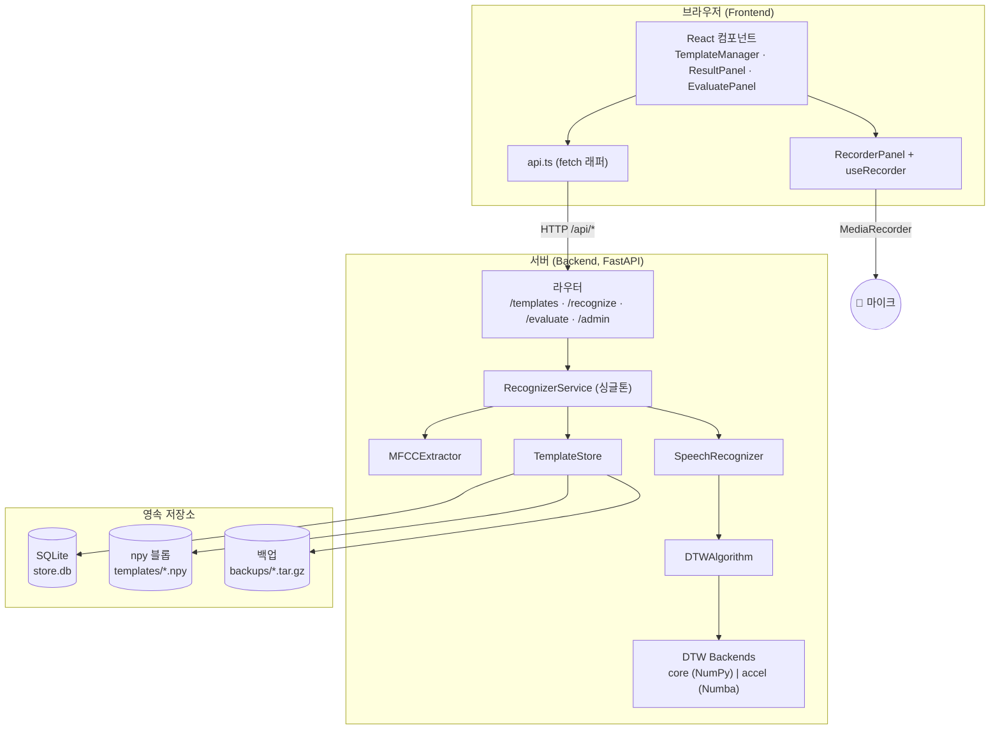

---

## 2. 클래스 다이어그램 (백엔드 도메인)

핵심 도메인 클래스와 관계.

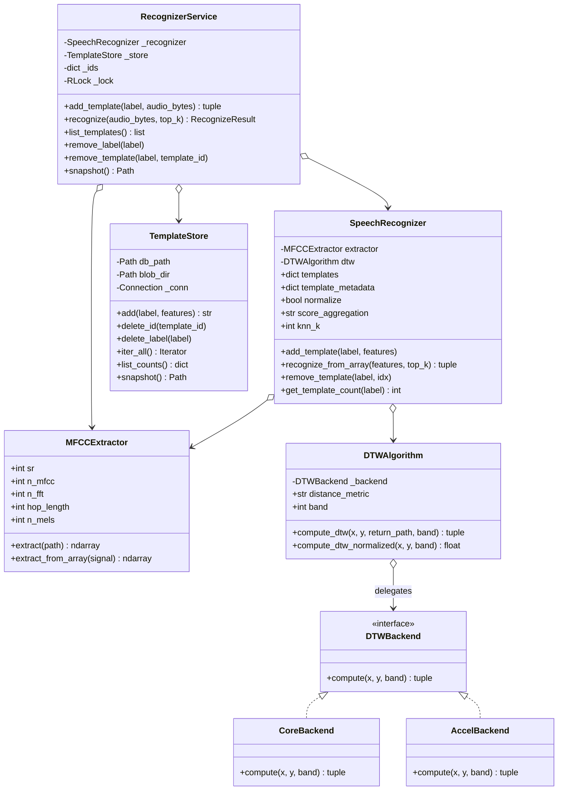

---

## 3. 클래스 다이어그램 (응답 스키마)

Pydantic 응답 모델.

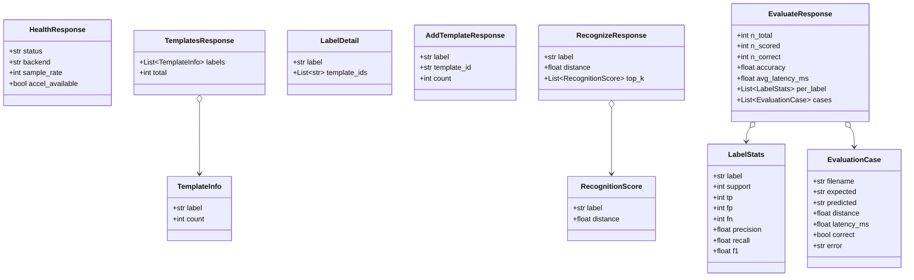

---

## 4. 시퀀스 다이어그램 — 템플릿 등록

`POST /api/templates` 흐름.

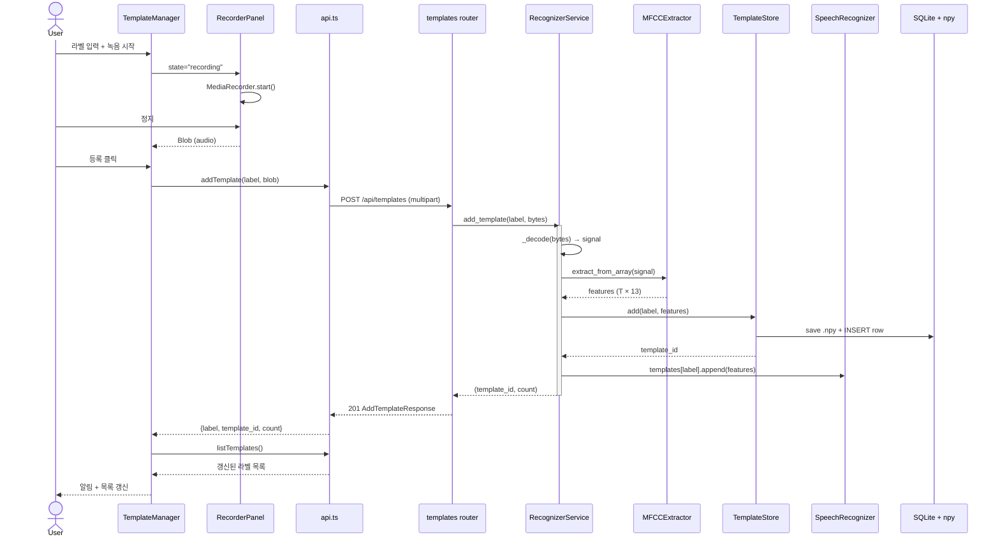

---

## 5. 시퀀스 다이어그램 — 단일 인식

`POST /api/recognize` 흐름.

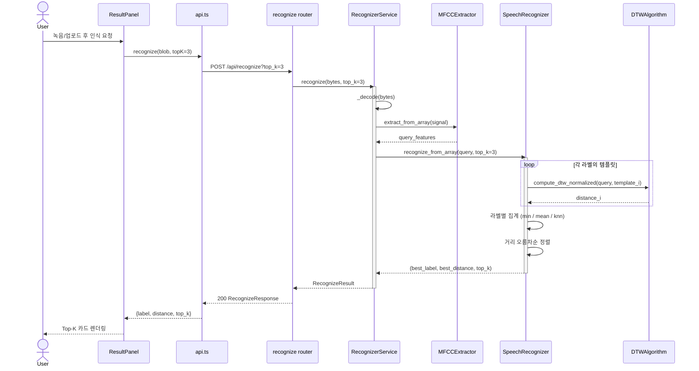

---

## 6. 시퀀스 다이어그램 — 배치 평가

`POST /api/evaluate` 흐름.

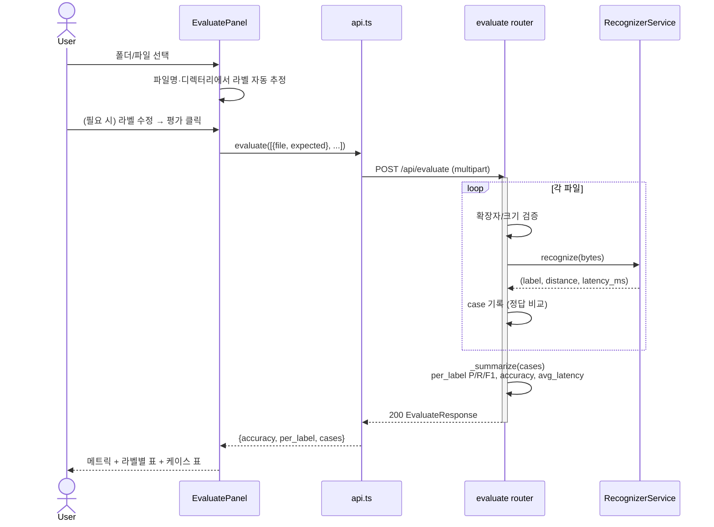

---

## 7. 상태 다이어그램 — 마이크 녹음 (`useRecorder`)

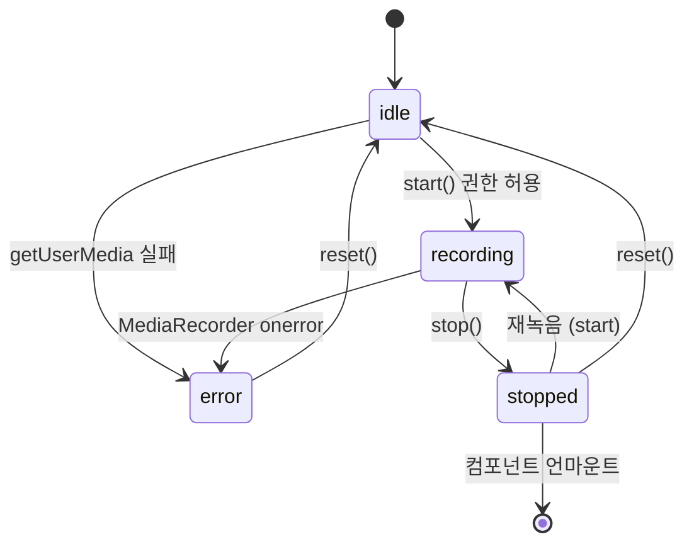

---

## 8. 활동 다이어그램 — DTW 백엔드 선택

`backends/__init__.py`의 `get_backend("auto")` 동작.

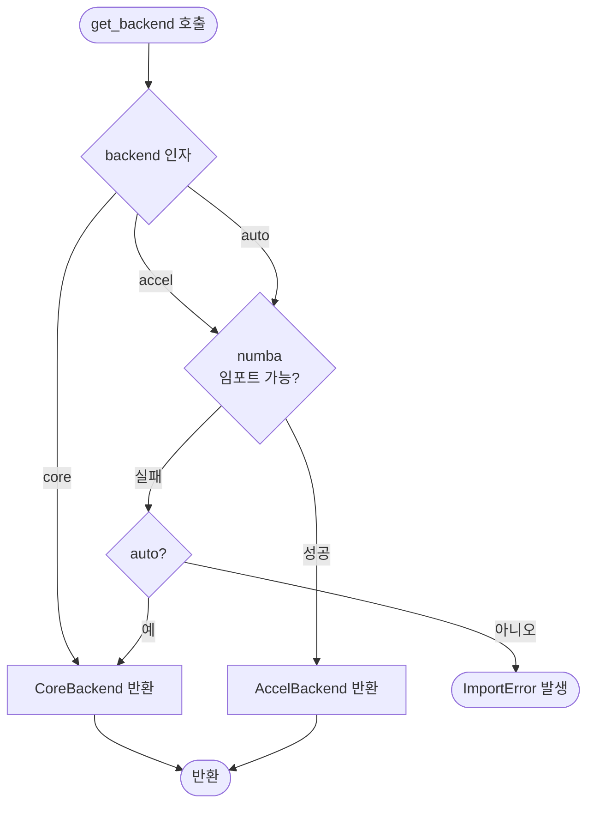

---

## 9. ER 다이어그램 — 영속 저장소

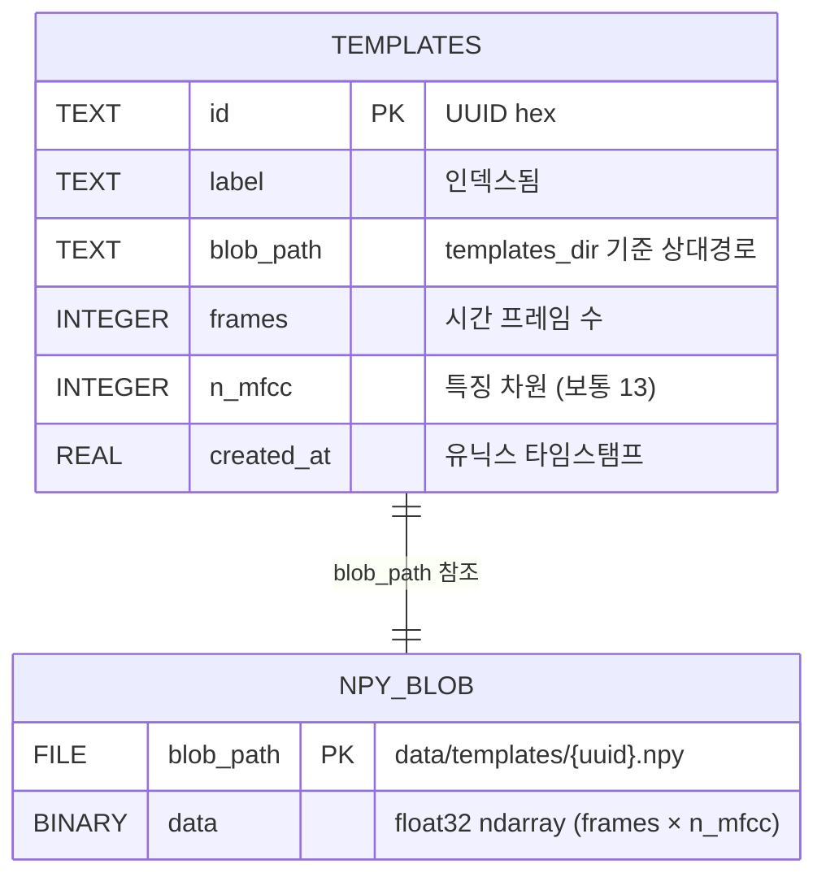

> 메타데이터는 SQLite, 특징 행렬은 별도 `.npy` 파일에 저장됩니다. `blob_path` 컬럼이 둘을 묶는 외래 참조 역할을 합니다 (FK 제약은 없음 — 파일시스템 참조).

---

## 10. 배포 다이어그램

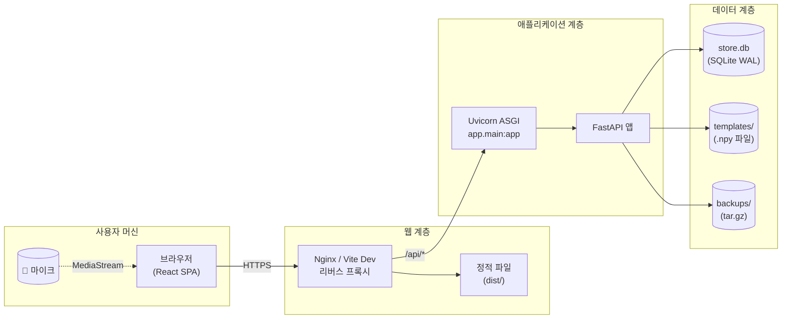

---

## 11. 패키지 의존 다이어그램

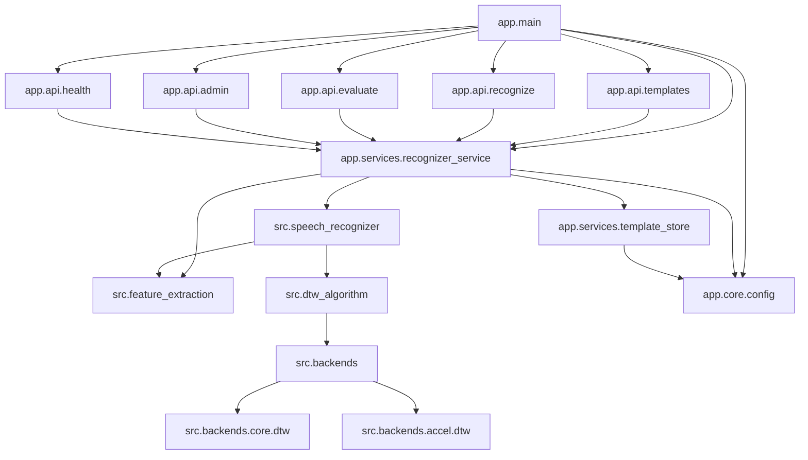

---

## 부록: Mermaid 렌더링 안내

- **GitHub**: `.md` 미리보기에서 자동 렌더링됩니다.
- **VSCode / JetBrains**: Mermaid 플러그인 또는 내장 미리보기 사용.
- **로컬 PNG/SVG 추출**: [`mermaid-cli`](https://github.com/mermaid-js/mermaid-cli) (`mmdc -i uml.md -o uml.png`).
